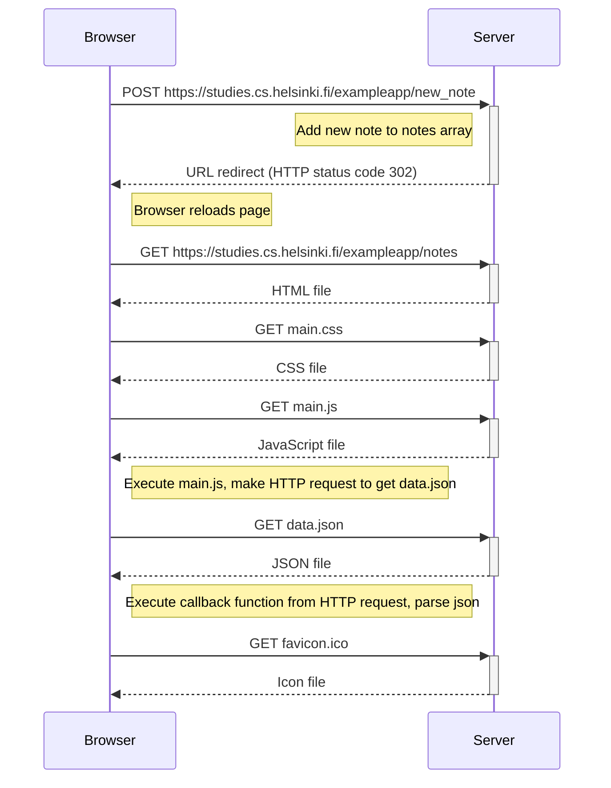

```mermaid
sequenceDiagram
  Browser ->>+ Server: POST https://studies.cs.helsinki.fi/exampleapp/new_note
  Note left of Server: Add new note to notes array
  Server -->>- Browser: URL redirect (HTTP status code 302)
  Note right of Browser: Browser reloads page
  Browser ->>+ Server: GET https://studies.cs.helsinki.fi/exampleapp/notes
  Server -->>- Browser: HTML file
  Browser ->>+ Server: GET main.css
  Server -->>- Browser: CSS file
  Browser ->>+ Server: GET main.js
  Server -->>- Browser: JavaScript file
  Note Right of Browser: Execute main.js, make HTTP request to get data.json
  Browser ->>+ Server: GET data.json
  Server -->>- Browser: JSON file
  Note right of Browser: Execute callback function from HTTP request, parse json
  Browser ->>+ Server: GET favicon.ico
  Server -->>- Browser: Icon file
```
