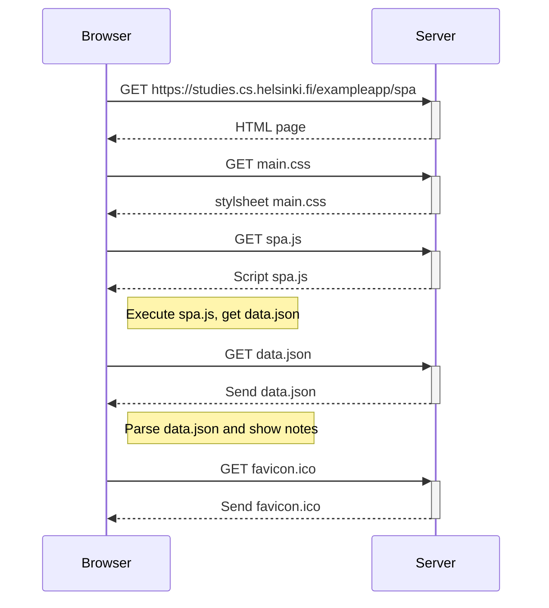

```mermaid
sequenceDiagram
    participant Browser
    participant Server

    Browser ->>+ Server: GET https://studies.cs.helsinki.fi/exampleapp/spa
    Server -->>- Browser: HTML page
    Browser ->>+ Server: GET main.css
    Server -->>- Browser: stylsheet main.css
    Browser ->>+ Server: GET spa.js
    Server -->>- Browser: Script spa.js
    Note right of Browser: Execute spa.js, get data.json
    Browser ->>+ Server: GET data.json
    Server -->>- Browser: Send data.json
    Note right of Browser: Parse data.json and show notes
    Browser ->>+ Server: GET favicon.ico
    Server -->>- Browser: Send favicon.ico
```
