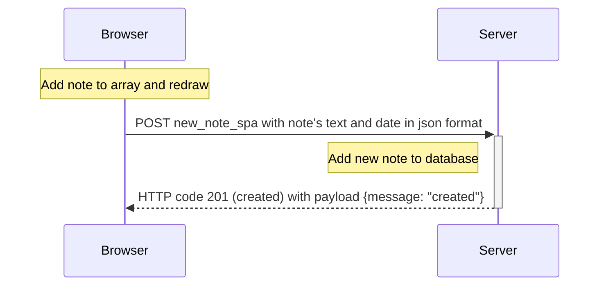

```mermaid
sequenceDiagram
    participant Browser
    participant Server

    Note over Browser: Add note to array and redraw
    Browser ->>+ Server: POST new_note_spa with note's text and date in json format
    Note left of Server: Add new note to database
    Server -->>- Browser: HTTP code 201 (created) with payload {message: "created"}
```
